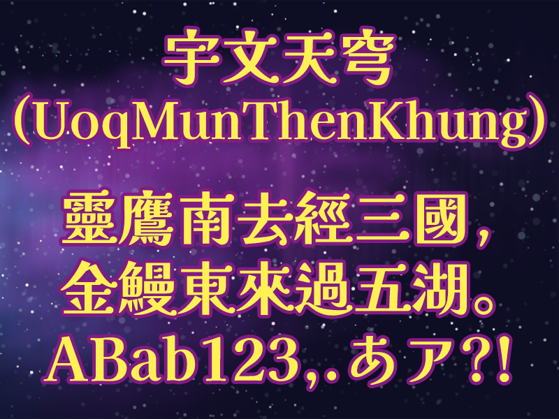

# 🌕宇文天穹 UoqMunThenKhung

## 🌕提要

「宇文天穹（UoqMunThenKhung）」爲適用於繁體中文環境的開源字型，它以[日本「解星計劃」開發的「解星」字型](https://github.com/FontKai-Kaisei/Kaisei)爲基礎，參照[傳承字形標準化文件](https://github.com/ichitenfont/inheritedglyphs)的推薦形體修改爲中文傳統字形，補製欠缺的漢字。

## 🌕下載

目前最新版本爲1.000版，發佈於2023年12月24日，已補完和改製了Big-5碼「常用字區」的5401字。

🌕 [宇文天穹 Version1.000 下載](fonts/UoqMunThenKhung-1.000.ttf) 🌕

## 🌕製作說明

日本「解星計劃」自2016年起開發[「解星」系列開源字型](https://github.com/FontKai-Kaisei/Kaisei)，計有常（Regular）、中（Medium）、特（Bold）、超（Extrabold）四種粗細，設計者爲[金井和夫](https://font-kai.jp/)。字體的設計，可謂糅合了明、黑、圓與一些書法的特色。橫細豎粗以及橫筆末端的小圓形，顯然脫胎自明體。但左上角、右上角、左下角的表現有黑體的乾淨清爽。右下角和撇、捺、鈎等筆畫的弧度，又融合了圓體甚至楷書的柔和可親。原字型亦有幾種不同風格的假名與漢字混搭，供使用者選擇。唯漢字部份，乃以日本使用的字形爲繩，且只製作好Adobe-Japan1-3範圍的漢字，不敷日常中文應用。

香港VTuber[宇文滿月](https://lit.link/en/moonlitowen)在選擇主要使用的字型時，看到此字型宜莊宜諧，既能登大雅之堂也不失親切，其小圓形特色也讓人有星空、宇宙之聯想，遂決定依開源精神，把此日本字型改製爲繁體中文字型。考慮到個人能付出的時間和能力，滿月先挑選整個系列中的指定一套字型來改製。綜合各方因素後，滿月選定粗細度爲特、配搭オプティ（Opti）式假名者作爲基礎，改製成「宇文天穹」此字型。

目前宇文滿月已補完和改製了Big-5碼「常用字區」的5401字，先公開發佈，以饗大眾。日後還會繼續增補和修改。

製作過程中，曾得[內木一郎](https://github.com/SyaoranHinata)、[佟藍歌](https://github.com/aikahiiragi)之協助，部份字元亦參照過貓啃網上爲簡體中文而設、由[劉鵬改製的「江城解星體」](https://www.maoken.com/freefonts/15107.html)，謹此鳴謝。

## 🌕字形說明

漢字字形向來千姿百面，印刷或屏顯的設計美觀需求與手寫書法的審美角度不盡相同，符合字理字源的傳統正字與書寫便捷的俗體變體也各有着眼點。而會使用傳統中文、繁體中文的地區，也有不同的敎育和非敎育標準或參考，這些標準或參考各有其立場，各有不同的適用與不適用場合，有時或會令有人顧此失彼之感。

考慮到此字型畢竟爲印刷或屏顯設計，儘管糅合了一些書寫特色，但仍以明黑等印刷字體爲主軸，滿月製作繁體中文版本時，主要參考傳統印刷字形，即「傳承字形」（或稱「舊字形」），並以[開源組織「一點字坊」](https://github.com/ichitenfont)維護的[傳承字形標準化文件](https://github.com/ichitenfont/inheritedglyphs)爲依據。其推薦形體平衡了字理字源、設計審美與約定俗成三者之考慮，不會爲了其中一者就無視其他方面的需求，堪稱完備。推薦形體也跟各地看到的傳統印刷字形相當一致，放諸四海皆合宜，方便跨地區應用。

唯因本字形也非完全與明體、黑體一致，因應其設計所需及綜合考慮，它有個別地方跟傳承字形標準化文件上的推薦形體有異。包括：
- 因末端小圓形的設計，「豎曲」會跟「豎曲鈎」混同，「橫曲」會跟「橫曲鈎」混同，「捺」會跟「捺鈎」混同，「扁捺」會跟「扁捺鈎」混同。
- 「豎」與「挑」會合成「豎挑」一筆。
- 撇筆、捺筆起筆處相觸或會使字形太黑，因此未必相觸。這會導致「木部件」與「朩（小木）部件」混同，故後者盡量改用有鈎的造型。
- 「肖部件」、「害/憲/㓞/丯部件」、「茲部件」、「匀部件」、「曷部件」、「夜部件」採用第二式。
- 「雨部件(在上)」的四點向內聚。
- 若不構成部件對立，框內橫筆末端是否與外框相觸，皆維持原「解星」字型之設計。
- 點的方向多遵從原「解星」字型之設計，靈活多變。

## 🌕示範

## 🌕聯絡滿月
關於本字型的問題，可以在本專案的[issue](https://github.com/MoonlitOwen/ThenKhung/issues)上提出。

滿月自己是VTuber，平日活躍於YouTube和社交媒體，歡迎瀏覽滿月的連結集：[http://lit.link/moonlitowen](http://lit.link/moonlitowen)，訂閱[滿月的YouTube頻道](https://www.youtube.com/@moonlitowen)和追蹤滿月的社交媒體💛💜

## 🌕鳴謝
* [解星系列字型](https://github.com/FontKai-Kaisei/Kaisei)
* [傳承字形標準化文件](https://github.com/ichitenfont/inheritedglyphs)
* [一點字坊（I.字坊 I.Font Project）](https://github.com/ichitenfont)
